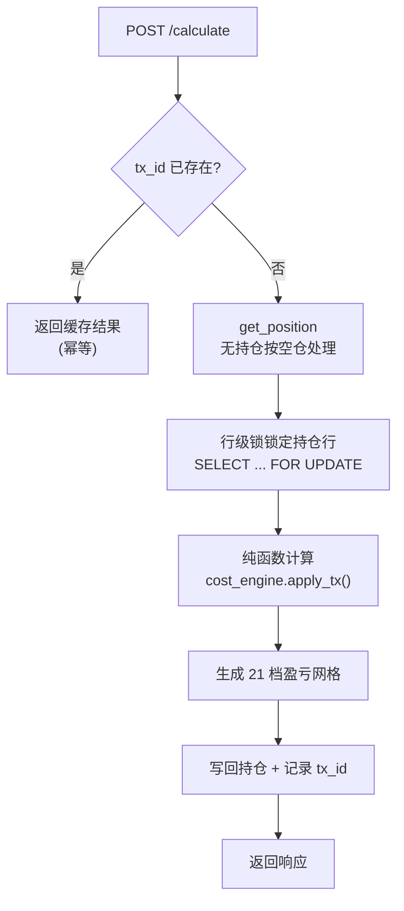
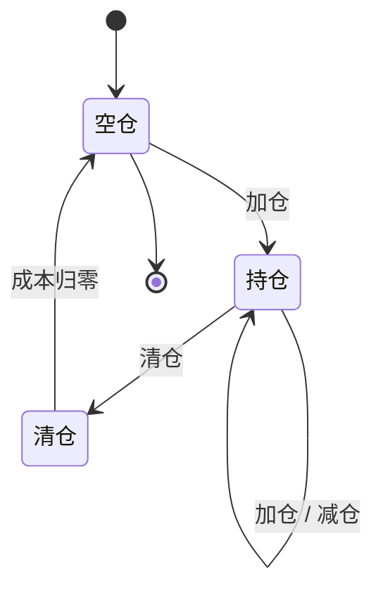

# 成本计算器算法文档 v2(评审后改造稿)

> 基于两轮评审的结论改造。`【v2 改造】` 标注相对评审稿的变更点。

---

## 头部

**代码位置**
- `backend/app/core/cost_engine.py` — Domain 纯函数
- `backend/app/api/calculator.py` — API 层

**输入 / 输出**
- 输入:持仓快照(`shares`, `cost_price`)+ 交易指令(`tx_shares`, `tx_price`)
- 输出:交易后持仓(`shares`, `cost_price`, `total_cost`)+ 成本变动 `delta` + 已实现盈亏 `realized` + 21 档盈亏网格

**设计原则**
1. 确定性——相同输入永远产生相同输出
2. 无状态——纯函数不依赖外部可变状态
3. 全程 Decimal 精度——中间计算不量化,仅输出量化

**范围边界** `【v2 改造:从原 §6 缺陷清单提升为正式边界声明】`

本引擎仅处理持仓份额与平均成本的变动,**不纳入任何交易费用**(佣金、印花税、过户费、滑点)。税费摊薄由券商侧或上层业务系统处理,不在本引擎职责内。盈亏网格中的 PnL 同样不含费,这是设计自洽的结果而非缺陷。

---

## §0 口径定义 `【v2 新增:定调评审首要议题】`

**采用标准移动加权平均法(成本法)。**

核心原则:卖出不改变剩余持仓的单位成本,卖出盈亏全额计入已实现损益(`realized`),不回灌成本。此口径与券商主流展示一致。

> `【v2 改造:修正 docstring 矛盾】` 原 docstring 将减仓后总成本描述为"现金回收 $T_0 - S_1 P_1$",实际实现为"按成本冲减 $C_0 \times S'$"。两者数学上不等价(差额 $= S_1(P_1 - C_0) =$ 已实现收益)。评审结论:实现正确,docstring 描述错误。v2 统一采用成本法口径,docstring 修正为"按成本冲减"。

---

## §1 核心公式

变量约定:$S_0$ 交易前份额,$C_0$ 交易前单位成本,$T_0 = C_0 \times S_0$ 交易前总成本,$S_1$ 交易份额,$P_1$ 交易价格。带撇符号为交易后值。

**加仓**($S_1 > 0$,买入)

$$S' = S_0 + S_1$$

$$T' = C_0 \cdot S_0 + P_1 \cdot S_1$$

$$C' = \frac{T'}{S'}$$

$$\text{realized} = 0, \quad \text{delta} = C' - C_0$$

**减仓**($S_1 > 0$,卖出,$S_1 < S_0$)

$$S' = S_0 - S_1$$

$$C' = C_0 \quad \text{(不变)}$$

$$\text{realized} = (P_1 - C_0) \cdot S_1$$

$$T' = C_0 \cdot S' \quad \text{(按成本冲减,非按成交价回收)}$$

$$\text{delta} = 0$$

**清仓**($S_1 = S_0$,全部卖出)

$$S' = 0, \quad C' = \text{None}, \quad \text{delta} = \text{None}$$

$$\text{realized} = (P_1 - C_0) \cdot S_0$$

**边界条件**

| 条件 | 处理 |
|---|---|
| 卖超 $S_1 > S_0$ | 422 `INSUFFICIENT_SHARES` |
| $S_1 \leq 0$ 或 $P_1 \leq 0$ | `ValueError` → 422 |

---

## §2 精度策略

全程 Decimal;价格量化 3 位、金额 2 位,均 `ROUND_HALF_UP`。

卖出用未量化 avg_cost 计算(避免累计漂移),输出才量化。

**链式做 T 精度漂移**(已知取舍):链式做 T 时,数据库存储量化后的 `cost_price`(3 位),每次回写再读回,精度逐次截断。当前测试允许 10.529 / 10.530 浮动。

> `【v2 改进建议】` 若做 T 链路为高频场景,建议在持仓表增加 `total_cost_raw`(全精度 Decimal,不量化)字段作为计算源,`cost_price` 仅作展示字段。链式计算始终基于全精度,输出时再量化,从根源消除漂移。代价为多一字段、需同步维护。若仅为一般展示用途,当前取舍可接受,但文档应标注"链式 N 次后累计误差量级预期"。

---

## §3 21 档盈亏表

基准 = 新成本 $C'$,$S' > 0$ 时生成,清仓 / 0 股 → 空表。

$$\text{price}_k = C' \times (1 + \text{pct}_k\%), \quad \text{mv}_k = \text{price}_k \times S', \quad \text{pnl}_k = \text{mv}_k - C' \cdot S'$$

> `【v2 改进:档位范围动态化】` 原 ±10% 固定档位仅覆盖主板涨跌停。改进为按标的类型动态调整:

| 标的类型 | 涨跌幅限制 | 网格范围 | 步长 | 档位数 |
|---|---|---|---|---|
| 主板 | ±10% | $[-10, +10]\%$ | 1% | 21 |
| 科创板 / 创业板 | ±20% | $[-20, +20]\%$ | 2% | 21 |

档位数保持 21 档不变,步长等比放大。

---

## §4 API 契约

**请求**

| 字段 | 约定 |
|---|---|
| `code` | 归一化:`600519` / `sh600519` / `.SH` → `600519.SH` |
| `tx_shares` | $> 0$,方向由 `tx_type`(buy/sell)区分 |
| `tx_price` | $> 0$,3 位小数 |
| `tx_id` | `【v2 新增】` 交易唯一标识,用于幂等去重 |

**响应**

```json
{
  "algo_version": "2.0",
  "input": { "code": "...", "tx_shares": "...", "tx_price": "...", "tx_type": "..." },
  "before": { "shares": "...", "cost_price": "...", "total_cost": "..." },
  "after":  { "shares": "...", "cost_price": "...", "total_cost": "...", "delta": "...", "realized": "..." },
  "pnl_grid": [ { "pct": "...", "price": "...", "mv": "...", "pnl": "..." }, ... ]
}
```

全字段字符串保精度。`【v2 新增】` `algo_version` 字段标记算法口径版本,口径变更时递增。

字符串数字格式约定:价格固定 3 位小数不足补零,金额固定 2 位不足补零,份额为整数无小数。

---

## §5 调用链



> `【v2 新增:并发安全】` `get_position` → 纯函数 → 写回链路中,若同一持仓并发提交两笔交易,存在读写竞态。建议在读取持仓时使用行级锁(`SELECT ... FOR UPDATE`),或乐观锁(持仓表增加 `version` 字段,写入时校验版本号,冲突时返回 409 让客户端重试)。

> `【v2 新增:幂等性】` 同一笔交易重复提交时,通过 `tx_id` 去重。引擎维护已处理 `tx_id` 集合(或依赖数据库唯一约束),重复提交直接返回首次计算结果,不重复变更成本。

### §5.1 当前实现现状

> `【评审落地说明】` 当前 `POST /api/calculator` 为**纯试算**,只调用 `get_position` 读取持仓、不写库、不产生交易、不影响持仓成本。真实写路径在 transactions 流水链路(`recalc_position` 重算持仓),由 `aggregate_positions` 纯函数在同一事务内完成,天然无竞态。

> 因此 §4 中 `tx_id` / §5 中行级锁 / 乐观锁 / 写回链路,均为**未来落单场景预留规格**——当计算器增加"确认下单"按钮,把试算结果真正写入持仓表和流水时,这些机制同步启用。**当前不适用,不需在代码中实现**。

---

## §6 持仓状态机



清仓后持仓重置为空仓状态(`shares=0`, `cost_price=None`),后续可重新建仓。

---

## §7 已知特性(诚实清单)

> `【v2 改造:手续费相关条目移出,清单收敛为 2 条】`

1. **链式做 T 精度漂移**:见 §2。根源为数据库存储量化后成本,链式回写累计截断。当前以量化后 `cost_after` 回填 `cost_before`,3 位精度累计。测试已允许 10.529 / 10.530 浮动。若引入 `total_cost_raw` 全精度字段可根治,待评估投入产出。

2. **口径与摊薄法的差异**:本引擎采用成本法(卖出不改单位成本)。部分散户 App 采用摊薄法(卖出盈利降低显示成本)。两者在减仓后 `C'` 上存在差异——成本法 $C' = C_0$,摊薄法 $C' = (C_0 S_0 - P_1 S_1) / S'$。当前以成本法为准,`algo_version` 标记为 `"2.0"`。若后续业务需要切换为摊薄法,递增版本号并同步修改减仓公式与网格基准。

---

## §8 测试用例清单 `【v2 新增】`

| 用例 | 操作 | 预期 | 验证点 |
|---|---|---|---|
| 空仓加仓 | 0 股 → 买 1000@10 | S=1000, C=10, realized=0 | 建仓正确 |
| 加仓摊薄 | 1000@10 → 买 1000@12 | S=2000, C=11, delta=+1 | 加权平均 |
| 减仓不变成本 | 1500@10.667 → 卖 300@12 | S=1200, C=10.667, realized=399.90 | 成本法核心:C 不变 |
| 清仓 | 1000@10 → 卖 1000@12 | S=0, C=None, realized=2000 | 清仓归零 |
| 卖超 | 500@10 → 卖 600@12 | 422 INSUFFICIENT_SHARES | 边界拦截 |
| 非法输入 | 买 0 股 / 买 -100 股 / 价格 0 | 422 | 参数校验 |
| 链式做 T | 加仓→减仓→加仓→减仓 N 轮 | 成本漂移 ≤ 0.001 | 精度边界 |
| 幂等 | 同 tx_id 提交 2 次 | 第 2 次返回首次结果 | 去重(未来场景) |
| 代码归一化 | `sh600519` / `600519` / `.SH` | 统一为 `600519.SH` | 输入清洗 |
| algo_version | 任意请求 | 响应 `algo_version="2.0"` | 版本标记 |

> `注` 幂等用例为未来落单场景,当前不实施。

---

## §9 版本化 `【v2 新增】`

| 版本 | 口径 | 变更内容 |
|---|---|---|
| 2.0 | 成本法(移动加权平均) | 评审后定调,修正 docstring,手续费划为边界,新增幂等/并发/版本化(未来场景预留) |

API 响应携带 `algo_version`,前端可据此判断口径并做兼容处理。口径变更(如切换摊薄法)时递增大版本号,公式微调(如精度策略变化)递增小版本号。