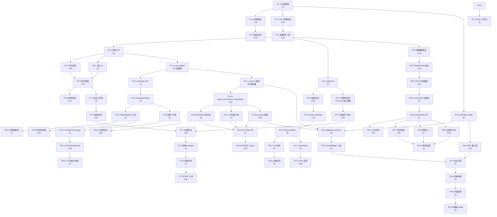

# 开发计划文档:买股工具室 MVP

**文档版本**:v2.1
**创建日期**:2026-08-01
**最后更新**:2026-08-01(v2.1 新增 P1.4 Key 管理后端 + P7.12 Key 管理 UI;工时 +1.5h = 88.5h ≈ 11d)
**文档状态**:已通过评审,准备实施
**目标读者**:开发者(自用项目,实际就是用户本人)
**配套文档**(本文档引用):
- `project-book.md` v1.8(PM 项目书,Source of Truth;模块定义见第三章,实施步骤见第七章,验收见 §7.2,失败迁移见 §9.5,AI 评语价值见 §9.6)
- `ui-ux-design.md` v1.6(UI/UX 设计书;组件清单见第 5 章,关键页面见第 4 章,隐私品牌见 §13.5,onboarding 见 §3.3 → project-book §3.3)
- `backend-architecture.md` v1.4(后端架构;目录见第 3 章,API 见第 7 章,SSE 见第 8 章,并发安全见 §4.6,akshare 见 §5.8,多设备见 §14.4)
- `frontend-architecture.md` v1.3(前端架构;目录见第 3 章,Zustand 见第 6 章,SSE 客户端见第 8 章,暗色图表见 §9.4,TS 严格性见 §12.5)
- `testing-strategy.md` v1.0(测试策略;验收映射见第 5 章,频率见第 6 章)
- `release-process.md` v1.0(发布流程;检查清单见第 2 章,发布步骤见第 3 章)
- `data-source-guide.md` v1.0(数据源获取指南)

**文档层级**:本文档引用 `project-book.md`,冲突以 `project-book.md` 为准
**变更历史**:
- [v1.0] 2026-08-01:基于 v1.8 项目书 + 5 份配套文档定稿,排定 35 个 Phase / 8 个工作日计划
- [v1.1] 2026-08-01:新增 §17 开发者工作时间块(排班表)+ §18 任务进度表(35 Phase 打卡)+ DP-7 / DP-8
- [v1.2] 2026-08-01:P4.2 拆细为 6 个子 Phase(落地 DeepSeek + MiniMax + 豆包 三 Provider),新增 P7.11 Provider 设置卡 + A/B 重生成 UI;工时 +7h;§17.3 排班微调;新增 DP-9 / DP-10
- [v2.0] 2026-08-01:新增截图识别 P8.1~P8.10(PaddleOCR + LLM 主路径 + 粘贴 JSON 降级路径);砍 P6.2~P6.4 年度账单前端;总工时 76h → 87h ≈ 11d;新增 DP-11 / DP-12 / R22
- [v2.1] 2026-08-01:新增 P1.4 Key 管理后端 + P7.12 Key 管理 UI(Fernet 加密 + UI 输入 + 测试连接);工时 +1.5h → 88.5h;新增 DP-13

---

## 1. 总览

- **目标**:买股工具室 MVP 上线,跑通"录入 → 计算 → 诊断 → 止损 → 年度账单"完整闭环
- **总工时**:**56h 核心 + 11h buffer(R17)= 67h ≈ 8.5 个 8h 工作日**
- **节奏**:每天 8h,日历约 1.5 周(含周末休可至 2 周)
- **关键路径**:S1 → S2 → S3 → S3.5 → S4 → S5 → S6 → S7
- **触发二期**:MVP 完成后**当天**启动 stock_project-master 二期规划(详见 §11)
- **环境**:Windows 11 + PowerShell 5.1,Python 3.13.14、Node 22.13.0、npm 10.9.2(已探测)

### 1.1 阶段图

```mermaid
gantt
    title 买股工具室 MVP 实施甘特(Day 1~8)
    dateFormat  HH:mm
    axisFormat  %H:%M

    section S1 搭骨架
    P1.1 后端骨架           :p11, 09:00, 2h
    P1.4 Key 管理后端       :p14, 11:00, 0.5h
    P1.2 前端骨架           :p12, 13:30, 1.5h
    P1.3 类型生成与连通      :p13, 15:00, 0.5h

    section S2 流水录入
    P2.1 数据层 3 表        :p21, 14:00, 1.5h
    P2.2 后端交易 API        :p22, 15:30, 1h
    P2.3 持仓聚合            :p23, 16:30, 0.5h

    section S3 计算器(主菜)
    P3.1 cost_engine 纯函数  :p31, 09:00, 3h
    P3.2 calculator API     :p32, 12:00, 1h
    P3.3 CalculatorPanel    :p33, 14:00, 2h
    P3.4 PnlHeatmap 21 档    :p34, 16:00, 3h

    section S3.5 今日盈亏
    P3.5 股票选择+行情      :p35, 09:00, 2h
    P3.6 计算器联调          :p36, 11:00, 1h
    P3.5.1 PositionOut today :p351, 13:00, 1h
    P3.5.2 StockQuoteCard   :p352, 14:00, 1.5h
    P3.5.3 场景标识          :p353, 15:30, 0.5h
    P3.5.4 今日盈亏验收      :p354, 16:00, 1h

    section S4 单笔诊断
    P4.1 scorer 5 维度       :p41, 09:00, 3h
    P4.2a BaseLLM+DeepSeek   :p42a, 12:00, 1.5h
    P4.2b MiniMax 客户端      :p42b, 09:00, 1h
    P4.2c 豆包客户端          :p42c, 10:00, 1h
    P4.2d Factory 集成        :p42d, 11:00, 0.5h
    P4.3 EventBus+SSE        :p43, 13:30, 2h
    P4.4 diagnose_service    :p44, 15:30, 1h
    P4.5 ScoreBadge+三态     :p45, 09:00, 2h
    P4.6 SSE 客户端封装      :p46, 11:00, 1.5h
    P4.7 流水列表订阅         :p47, 12:30, 1h
    P4.8 诊断端到端验收      :p48, 13:30, 1h
    P4.9 评语反馈            :p49, 14:30, 1h
    P4.10 脱敏可核验 tooltip :p410, 15:30, 1h
    P4.2e Provider API       :p42e, 14:30, 1h
    P4.2f A/B 对比 fixture   :p42f, 15:30, 0.5h

    section S5 止损提醒
    P5.1 止损后端 API       :p51, 09:00, 1h
    P5.2 触发标记 API        :p52, 10:00, 0.5h
    P5.3 StopLossModal       :p53, 11:00, 1.5h
    P5.4 StopLossAlert 全屏  :p54, 13:00, 2h
    P5.5 useStopLossChecker  :p55, 15:00, 2h
    P5.6 止损联调边界        :p56, 17:00, 1h

    section S6 年账单后端(v2.0 仅后端,前端砍)
    P6.1 年账单后端聚合(v0.2 接口预留) :p61, 09:00, 1.5h

    section S8 截图识别(v2.0 新增)
    P8.1 截图数据层         :p81, 14:00, 0.5h
    P8.2 PaddleOCR 封装      :p82, 14:30, 1.5h
    P8.3 OCR 字段提取        :p83, 16:00, 1.5h
    P8.4 screenshot 主路径   :p84, 09:00, 1h
    P8.5 screenshot API      :p85, 10:00, 1h
    P8.6 上传向导 + Dropzone :p86, 13:00, 1.5h
    P8.7 预览表格 + 置信度   :p87, 14:30, 1.5h
    P8.8 降级模式 UI         :p88, 16:00, 1h
    P8.9 设置页截图卡片      :p89, 17:00, 0.5h
    P8.10 联调 + 边界        :p810, 09:00, 1h

    section S7 联调+发布
    P7.1 onboarding 3 步    :p71, 13:00, 1h
    P7.2 状态设计三件套      :p72, 14:00, 1h
    P7.3 设置页+导出/导入    :p73, 15:00, 1.5h
    P7.4 暗色回归+键盘可达   :p74, 16:30, 0.5h
    P7.5 22:00反思+全局水印  :p75, 09:00, 0.5h
    P7.6 同花顺对账 5 持仓   :p76, 09:30, 0.5h
    P7.7 全量测试+迁移还原   :p77, 10:00, 1.5h
    P7.8 端到端冒烟+release-notes :p78, 11:30, 1h
    P7.9 文档同步+备份归档   :p79, 12:30, 1h
    P7.10 MVP 上线→二期触发 :p710, 13:30, 0.5h
    P7.11 Provider 设置 UI    :p711, 16:00, 1.5h
    P7.12 Key UI 输入        :p712, 17:00, 1h
```



---

## 2. Day 1(S1 + S2 前半)— 8h

### Phase 1.1 后端骨架 ⏱ 2h

| 项 | 内容 |
|---|---|
| **任务** | 初始化 backend/,FastAPI 0.115 + SQLAlchemy 2 async + aiosqlite + Alembic + Pydantic v2 + httpx + .env + 日志结构化(loguru) |
| **产出** | `backend/app/main.py`(含 startup 跑 `alembic upgrade head`)+ `db.py` + `core/config.py`(pydantic-settings)+ `core/logging.py`(§12.4.1)+ `core/db_lock.py`(§4.5)+ `api/admin.py`(GET /health)|
| **验收** | `uv run uvicorn app.main:app --port 8000` 启动,GET /health 返回 `{status:"ok"}`,alembic 初始化空 DB |
| **引用** | backend-arch §3 目录 / §2 技术栈 / §6.4 Alembic / §4.5 db_write_lock / §12.4 监控埋点 |
| **依赖** | 无 |
| **风险** | Windows 路径 + uv 工具链,先确认 `uv --version` 已装 |

### Phase 1.2 前端骨架 ⏱ 1.5h

| 项 | 内容 |
|---|---|
| **任务** | `npx create-next-app@14 frontend --typescript --tailwind --app`,加 Radix UI / Headless UI / Zustand / React Hook Form / Zod / lucide-react / clsx / tailwind-merge / next-themes / framer-motion / echarts / openapi-typescript |
| **产出** | `frontend/tailwind.config.ts`(UI 书 16.2 映射)+ `src/styles/tokens.css`(CSS 变量)+ `app/layout.tsx`(ThemeProvider)+ `lib/api.ts`(axios + snake→camel,见 §7.1)+ `lib/types.ts`(stub)+ `lib/decimalFormat.ts` + `hooks/useDebounce.ts` |
| **验收** | `npm run dev` 启动 :5173,主题切换 OK,axios 实例可连后端(失败容错不崩) |
| **引用** | frontend-arch §2 / §3 / §9.3 / §7.1 axios |
| **依赖** | 1.1 后端在跑(只读 stub 类型可独立完成) |
| **风险** | Next.js 14 在 Win11 偶有 port 占用,确认 5173 空闲 |

### Phase 1.3 类型生成与连通 ⏱ 0.5h

| 项 | 内容 |
|---|---|
| **任务** | `npm run gen-types`(§12.2),对比 stub 与生成类型差异(diff 字段),前端写一个 smoke 页面调 GET /api/health 验证联调 |
| **产出** | 类型生成脚本、smoke 页面(临时) |
| **验收** | 生成后 `npm run typecheck` 通过 |
| **引用** | frontend-arch §12.1~12.4 |
| **依赖** | 1.1 + 1.2 |

### Phase 2.1 数据层(transactions / watchlist / trade_scores) ⏱ 1.5h

| 项 | 内容 |
|---|---|
| **任务** | Alembic 初始 migration:3 张表 + 4 索引(backend-arch §6.1 + §6.2)+ Repository 层(transactions / watchlist / trade_scores) |
| **产出** | `models/orm.py` + `repositories/transaction_repo.py` + `repositories/watchlist_repo.py` + `repositories/trade_score_repo.py` + Alembic 目录 |
| **验收** | `alembic upgrade head` 创建 3 表,`alembic downgrade base` 回滚干净 |
| **引用** | project-book §4.1.1 schema / backend-arch §6.1~§6.4 |
| **依赖** | 1.1 |
| **风险** | Decimal 类型在 SQLite + aiosqlite 序列化:统一用字符串存 DB,Decimal 仅在内存层 |

### Phase 2.2 后端交易 API ⏱ 1h

| 项 | 内容 |
|---|---|
| **任务** | POST/GET/PATCH/DELETE /api/transactions + TransactionCreate / TransactionOut Pydantic(backend-arch §7.1 + §7.2)+ 入参校验(卖出超额 422 / 价格 ≤ 0 / 代码格式)+ **写入必须 safe_write**(4.6 规则)|
| **产出** | `api/transactions.py` + `services/transaction_service.py` + 单测 `tests/test_transactions_api.py` |
| **验收** | 5 类场景单测覆盖(正常买/正常卖/卖出超额/价格 0/代码错) |
| **引用** | backend-arch §7.1 / §7.2 / §7.3 错误码 / §4.6.1 写锁表 |
| **依赖** | 2.1 |

### Phase 2.3 持仓聚合 ⏱ 0.5h

| 项 | 内容 |
|---|---|
| **任务** | `services/position_service.py` 聚合 transactions → 持仓(加权平均,project-book §4.1.2 SQL)+ PositionOut Pydantic + GET /api/positions(MVP 版暂不含今日盈亏) |
| **产出** | `services/position_service.py` + `api/positions.py` + 单测 |
| **验收** | 录入 3 笔(买 1000@10 / 买 500@11 / 卖 200@12)→ 持仓 = 1300 股 / 加权成本 ≈ 10.385 |
| **引用** | project-book §4.1.2 / backend-arch §6.1 |
| **依赖** | 2.2 |

---

## 3. Day 2(S2 后半 + S3 前半)— 8h

### Phase 2.4 前端流水录入 UI ⏱ 2h

| 项 | 内容 |
|---|---|
| **任务** | `components/transaction/TransactionForm.tsx`(React Hook Form + Zod schema,frontend-arch §10.3)+ `TransactionTable.tsx` + `TransactionRow.tsx` + 录入弹窗(ui-ux §4.3)+ 评分占位 `--` |
| **产出** | 3 个 transaction 组件 + `app/transactions/page.tsx` |
| **验收** | 表单提交后流水列表立即多一行,刷新后保留 |
| **引用** | ui-ux §4.3 / frontend-arch §10.3 |
| **依赖** | 2.2 + 1.2 |

### Phase 2.5 前端首页持仓概览(MVP 雏形) ⏱ 1.5h

| 项 | 内容 |
|---|---|
| **任务** | `components/transaction/StockQuoteCard.tsx`(暂不含今日盈亏与止损,见 S3.5 + S5)+ `app/page.tsx` 首页(持仓卡列表)+ 无持仓空状态(ui-ux §4.1.1)|
| **产出** | 首页雏形 |
| **验收** | 录入 → 首页持仓卡显示股数/成本/总成本 |
| **引用** | ui-ux §4.1 / frontend-arch §10.1 |
| **依赖** | 2.4 + 2.3 |

### Phase 2.6 后端单测补强 ⏱ 0.5h

| 项 | 内容 |
|---|---|
| **任务** | `tests/test_transactions_api.py` + `tests/test_position_service.py` 覆盖 4 类场景 |
| **产出** | 单测 100% 通过 |
| **引用** | testing-strategy §3.1 |

### Phase 3.1 cost_engine 纯函数 + 100% 单测 ⏱ 3h

| 项 | 内容 |
|---|---|
| **任务** | `core/cost_engine.py` 两个核心函数(backend-arch §5.1):`calculate_after_transaction` + `build_pnl_grid`,全 Decimal 精度,21 档,清仓边界;**100% 单测**覆盖 4 类场景(加仓/减仓/做T/清仓)+ 异常(卖出超额 / 价格 0 / 股数 0)|
| **产出** | 纯函数模块 + `tests/test_cost_engine.py` 20+ 用例 |
| **验收** | `pytest tests/test_cost_engine.py --cov` 100%;与同花顺 5 个真实持仓人工对照,误差 ≤ 0.01(此步骤可在 S7 跑)|
| **引用** | project-book §4.2.2 算法 / §4.2.3 21 档 / backend-arch §5.1 |
| **依赖** | 无(纯函数,可独立完成) |
| **风险** | **关键路径**,优先级最高;**不可省单测** |

### Phase 3.2 calculator API ⏱ 1h

| 项 | 内容 |
|---|---|
| **任务** | POST /api/calculator + CalculatorRequest / CalculatorResponse(backend-arch §7.2)+ 边界(卖出超额/无持仓卖出)→ 422 INSUFFICIENT_SHARES / 引导录入 |
| **产出** | `api/calculator.py` + `services/calculator_service.py` + 单测 `tests/test_calculator_api.py` |
| **引用** | project-book §4.2.5 边界 / backend-arch §5.1 / §7.1 / §7.2 |

---

## 4. Day 3(S3 后半 + S3.5)— 8h

### Phase 3.3 CalculatorPanel 左右分栏 ⏱ 2h

| 项 | 内容 |
|---|---|
| **任务** | `components/calculator/CalculatorPanel.tsx` 左右分栏(持仓 / 预交易)+ 实时计算(输入即算,<100ms)+ PositionPanel + 数字 Mono(ui-ux §4.2)|
| **产出** | 计算器主面板 + `app/calculator/page.tsx` |
| **验收** | 输入 1000@10 买 500@11 → 实时显示新成本 10.333 |
| **引用** | ui-ux §4.2 / frontend-arch §10.2 |
| **依赖** | 3.2 |

### Phase 3.4 PnlHeatmap 21 档 ⏱ 3h

| 项 | 内容 |
|---|---|
| **任务** | `components/charts/PnlHeatmap.tsx` 自研 SVG 21 档(颜色用 CSS 变量 9.4.2)+ **当前价标线** + 加仓区间高亮 + hover 放大 1.2x + 移动端折叠 5 档(ui-ux §5.3 + §4.2)|
| **产出** | 21 档可视化组件 + 暗色对比测试 |
| **验收** | 渲染 21 根柱,当前价标线位置正确,移动端 5 档折叠,暗色模式无"黑底黑字" |
| **引用** | ui-ux §5.3(v1.5 重设计) / frontend-arch §9.4 / project-book §4.2.3 |
| **依赖** | 3.3 |
| **风险** | 这是 UI 主菜之一,**关键路径**,投入最多 |

### Phase 3.5 股票选择 + 行情拉取 ⏱ 2h

| 项 | 内容 |
|---|---|
| **任务** | 股票代码输入 + AkShare 全市场列表联想 + Eastmoney 实时行情(`UnifiedQuote`,backend-arch §5.5)+ 5 分钟缓存(`JSONCache` 原子写 4.6.2)+ 失败降级骨架屏(ui-ux §11.1)|
| **产出** | `lib/stockSearch.ts` + `hooks/useQuote.ts` |
| **验收** | 输入 "000001" → 自动联想"平安银行";行情拉取 < 2s,失败显示骨架屏 |
| **引用** | data-source-guide §3 / backend-arch §5.4~§5.5 / §4.6.2 缓存原子写 / §5.8 akshare 锁版本 |
| **依赖** | 3.3 |
| **风险** | akshare `stock_zh_a_spot_em` 在 Windows + Python 3.13 可能装包慢,**提前 `uv pip install akshare==x.y.z` 锁定版本** |

### Phase 3.6 计算器联调 + 对账 ⏱ 1h

| 项 | 内容 |
|---|---|
| **任务** | 端到端跑通计算器;准备 5 个真实持仓的同花顺对账(可在 S7 整体对账,此处先过 happy path) |
| **验收** | 加仓/减仓/做T/清仓 4 类场景页面正确 |
| **引用** | project-book §7.2 验收标准 |

### Phase 3.5.1 PositionOut 加 today_pnl 字段 ⏱ 1h

| 项 | 内容 |
|---|---|
| **任务** | PositionOut Pydantic 加 `today_pnl` / `today_pnl_pct` / `prev_close` / `current_price`(backend-arch §5.5 UnifiedQuote)+ GET /api/positions 计算公式:`(current - prev_close) × shares`(project-book §4.7.2)|
| **产出** | `services/position_service.py` 增强 + PositionOut schema |
| **引用** | project-book §4.7.2 / §4.7.4 / backend-arch §7.2 PositionOut |
| **依赖** | 2.3 + 3.5(需要行情字段) |

### Phase 3.5.2 前端 StockQuoteCard 今日盈亏 ⏱ 1.5h

| 项 | 内容 |
|---|---|
| **任务** | `StockQuoteCard` 加"今日 +X.XX (+X%)"醒目行(红涨绿跌,等宽字体)+ 首页总览"今日总盈亏"+ 缓存命中 < 10ms |
| **产出** | 首页持仓卡 v2 |
| **验收** | 持仓卡显示今日盈亏,无行情时显示骨架屏 |
| **引用** | ui-ux §4.1(v1.4 新增) / project-book §4.7.3 |
| **依赖** | 3.5.1 |

### Phase 3.5.3 场景标识(轻量,顺带) ⏱ 0.5h

| 项 | 内容 |
|---|---|
| **任务** | `hooks/useMarketHours.ts`(frontend-arch §11.2)+ 首页顶部场景标签("盘后"默认)|
| **产出** | 时间段切换 |
| **引用** | ui-ux §4.1(v1.3 改造) |

### Phase 3.5.4 今日盈亏验收 + 单测 ⏱ 1h

| 项 | 内容 |
|---|---|
| **任务** | `tests/test_today_pnl.py` 覆盖 `current_price` / `prev_close` 边界(节假日 / 停牌 / 缓存) |
| **产出** | 单测 |
| **引用** | testing-strategy §3.1 |

---

## 5. Day 4(S4 上半)— 8h

### Phase 4.1 scorer 5 维度 + 0 数据降级 ⏱ 3h

| 项 | 内容 |
|---|---|
| **任务** | `core/scorer.py` 5 维度评分函数(project-book §4.3.2 + §4.3.6 完整伪代码)+ 0 数据降级(持仓 < 3 → 集中度 15,历史 < 2 → 操作间隔 15)+ 三档市场环境(顺势 20/中性 10/逆势 0)+ 板块热度 + **100% 单测** + ground truth 10 个样本对照(差 ≤ 10 分)|
| **产出** | `core/scorer.py` + `tests/test_scorer.py` 30+ 用例 + `tests/fixtures/ground_truth.json` |
| **验收** | 覆盖率 100%,与人工打分平均差 ≤ 10 分 |
| **引用** | project-book §4.3.2 / §4.3.6 / §4.3.4(盲点 7 客观性) / testing-strategy §4.2 |
| **依赖** | 3.1(已有数据)|
| **风险** | **关键路径**;ground truth 样本需要用户真实历史交易(脱敏) |

### Phase 4.2 DeepSeek 客户端 + 脱敏 + Prompt ⏱ 1.5h

| 项 | 内容 |
|---|---|
| **任务** | `llm/deepseek.py`(3 次指数退避,backend-arch §9.1)+ `llm/sanitizer.py`(只传 5 项:代码/方向/股数区间/日期/持仓占比,§9.2)+ `core/prompts.py` 模板(§9.3,含自选股措辞分支)|
| **产出** | LLM 模块 + 单测 stub DeepSeek 验证 Prompt 内容 |
| **引用** | backend-arch §9 / project-book §4.3.3 |
| **依赖** | 无 |

### Phase 4.3 EventBus + SSE 端点 ⏱ 2h

| 项 | 内容 |
|---|---|
| **任务** | `services/event_bus.py`(asyncio.Queue + 30s ping + 60s 死连接清理,backend-arch §8.3)+ `api/events.py`(`GET /api/events/sse`)+ 单测(EventBus publish 清理阻塞)|
| **产出** | SSE 基础设施 |
| **引用** | backend-arch §8 / §4.6.3 事件循环线程安全 |
| **依赖** | 1.1 |

### Phase 4.4 diagnose_service score_and_notify ⏱ 1.5h

| 项 | 内容 |
|---|---|
| **任务** | `services/diagnose_service.py`:`score_and_notify(trade_id)` 调用 scorer → safe_write 写 trade_scores → publish `trade.scored` → LLM → safe_write 写 ai_comment → publish `trade.commented` 或 `trade.failed`(backend-arch §5.3 + §4.6.1 修复漏锁)+ API:POST /diagnose/{id} / GET /diagnose/{id} |
| **产出** | 评分 + AI 编排 |
| **引用** | project-book §4.3.1 / backend-arch §5.3 / §10.2 任务编排 |
| **依赖** | 4.1 + 4.2 + 4.3 |

---

## 6. Day 5(S4 下半 + S5 前半)— 8h

### Phase 4.5 前端 ScoreBadge + ScoreDetail 三态 ⏱ 2h

| 项 | 内容 |
|---|---|
| **任务** | `components/signal/ScoreBadge.tsx`([72] 颜色按分数段,ui-ux §5.4)+ `ScoreDetail.tsx`(完整态 / 加载中骨架屏 / 失败重试按钮三态,§4.4.1)+ **[?] 角标** + "你比我更懂这笔交易"提示(§4.4 v1.5)+ 评分滚动数字动效(§10.2)|
| **产出** | 评分组件 |
| **引用** | ui-ux §4.4 / §5.4~5.5 / frontend-arch §10.4 |
| **依赖** | 2.4(已有交易列表行)|

### Phase 4.6 SSE 客户端封装 + 降级 ⏱ 1.5h

| 项 | 内容 |
|---|---|
| **任务** | `lib/eventSource.ts`(frontend-arch §8.1,心跳过滤 + 3 次失败降级 5s 轮询 + localStorage 持久化降级标志 + online 事件回切)+ `hooks/useSSE.ts` |
| **产出** | SSE 客户端 |
| **引用** | frontend-arch §8 / backend-arch §8.3 心跳 |

### Phase 4.7 流水列表订阅评分 + AI 评语 + 自选股联动 ⏱ 1h

| 项 | 内容 |
|---|---|
| **任务** | `useTransactionStore` 加 scores/comments 状态 + SSE 订阅更新 + 持仓外买入 WatchlistToast(ui-ux §4.5)|
| **产出** | 流水页面 v2 |
| **引用** | project-book §4.3.5 / ui-ux §4.5 |
| **依赖** | 4.5 + 4.6 + 4.4 |

### Phase 4.8 诊断端到端验收 ⏱ 1h

| 项 | 内容 |
|---|---|
| **任务** | 录入 10 笔交易 → 触发诊断成功率 ≥ 95%(project-book §7.2);单笔耗时 < 30s |
| **产出** | 验收记录 |
| **引用** | project-book §7.2 验收标准 / testing-strategy §5 |
| **依赖** | 4.7 |

### Phase 4.9 AI 评语价值反馈(盲点 5) ⏱ 1h

| 项 | 内容 |
|---|---|
| **任务** | `trade_scores.feedback` 字段(Alembic 迁移)+ 评分详情弹窗评语末尾"有用 / 没用"按钮(project-book §9.6)|
| **产出** | 反馈 UI + 数据字段 |
| **引用** | project-book §9.6.2 |

### Phase 4.10 评语脱敏可核验 tooltip(盲点 8) ⏱ 1h

| 项 | 内容 |
|---|---|
| **任务** | 评分详情弹窗"交易摘要"4 字展开 tooltip,列出实际传给 LLM 的 5 项字段(ui-ux §13.5.2 触点 2)|
| **产出** | 隐私触点 2 |
| **引用** | ui-ux §13.5.2 |

---

## 7. Day 6(S5 下半 + S6)— 8h

### Phase 5.1 止损后端 API ⏱ 1h

| 项 | 内容 |
|---|---|
| **任务** | stop_losses 表 + Alembic(backend-arch §6.1 第 4 表)+ Repository + POST/GET/DELETE /api/stop-losses + **safe_write 包**所有写路径(4.6.1 修复 4 号路径)|
| **产出** | 止损后端 |
| **引用** | project-book §4.8.3 / backend-arch §6.1 |
| **依赖** | 2.1(共用 ORM 基础)|

### Phase 5.2 止损触发标记 API ⏱ 0.5h

| 项 | 内容 |
|---|---|
| **任务** | POST /stop-losses/{code}/triggered + 幂等(同日重复返回 200 不报错)+ safe_write 包 |
| **产出** | 触发 API |
| **引用** | backend-arch §4.6.1 写锁表 4 |

### Phase 5.3 前端 StopLossModal 设置弹窗 ⏱ 1.5h

| 项 | 内容 |
|---|---|
| **任务** | `components/stop-loss/StopLossModal.tsx`(价格预览 + 触发后亏损 % + 4 种提醒方式 checkbox,ui-ux §4.6)+ `StopLossButton.tsx`(持仓卡 [+ 设止损] 按钮,§4.1)|
| **产出** | 止损设置 UI |
| **引用** | ui-ux §4.6 / §4.1 v1.4 新增 / project-book §4.8.3 |
| **依赖** | 5.1 |

### Phase 5.4 前端 StopLossAlert 全屏提醒 ⏱ 2h

| 项 | 内容 |
|---|---|
| **任务** | `StopLossAlert.tsx`(全屏 modal + maskClosable=false + 必选其一 + 个性化文案"再扛一下",ui-ux §4.7)+ Web Notification API + navigator.vibrate + audio(可关闭)|
| **产出** | 救命功能 UI |
| **引用** | ui-ux §4.7 / §11.5 |
| **依赖** | 5.3 |

### Phase 5.5 useStopLossChecker 15s 轮询 ⏱ 2h

| 项 | 内容 |
|---|---|
| **任务** | `hooks/useStopLossChecker.ts`(frontend-arch §11.1)+ 每个持仓每天最多 1 次触发 + 触发后写 last_triggered_at + 网络恢复检测 |
| **产出** | 定时轮询 hook |
| **引用** | frontend-arch §11.1 / project-book §4.8.2 |
| **依赖** | 5.4 |

### Phase 5.6 止损联调 + 边界 ⏱ 1h

| 项 | 内容 |
|---|---|
| **任务** | 边界:止损价 ≤ 当前价禁用保存提示;同一持仓当日已触发不重复;价格触达 → 15s 内弹 Notification(对应 stock_project 第十二章 §12.3.2 同样规则)|
| **产出** | 验收 |
| **引用** | ui-ux §11.5 |

### Phase 6.1 年账单后端聚合 ⏱ 1.5h

| 项 | 内容 |
|---|---|
| **任务** | `services/annual_report_service.py`(已实现于 backend-arch §5.7 + §13.2)+ GET /api/annual-report/{year} + 单测覆盖胜率/Top5/净盈亏 |
| **产出** | 后端 |
| **引用** | project-book §4.9.2 / backend-arch §5.7 / testing-strategy §3.1 |

---

## 8. Day 7(S6 后半 + S7 联调)— 8h

### Phase 6.2 前端 AnnualReportCard ⏱ 1h

| 项 | 内容 |
|---|---|
| **任务** | `components/annual-report/AnnualReportCard.tsx`(卡片 + Top 5 最赚/最亏,ui-ux §4.8)+ 永久入口(设置 → 关于)|
| **产出** | 年度账单卡片 |
| **引用** | ui-ux §4.8 / project-book §4.9.3 |
| **依赖** | 6.1 |

### Phase 6.3 年账单 1 月初自动出现 ⏱ 0.5h

| 项 | 内容 |
|---|---|
| **任务** | 首页检测当前日期:1 月初(自然年)显示年度卡;非 1 月隐藏 |
| **产出** | 时序逻辑 |
| **引用** | project-book §4.9.3 |
| **依赖** | 6.2 |

### Phase 6.4 年账单单测 ⏱ 0.5h

| 项 | 内容 |
|---|---|
| **任务** | `tests/test_annual_report_service.py` 覆盖胜率边界(全胜/全败/空年)|
| **产出** | 单测 |
| **引用** | testing-strategy §3.1 |

### Phase 7.1 onboarding 三步引导 ⏱ 1h

| 项 | 内容 |
|---|---|
| **任务** | 步骤 1 录入第一笔 + 步骤 2 看到评分 + 步骤 3 体验热力图(project-book §3.3 v1.7)+ 进度条 + 跳过按钮 |
| **产出** | onboarding 流程 |
| **引用** | project-book §3.3 / ui-ux §4.1.1 |

### Phase 7.2 状态设计三件套 ⏱ 1h

| 项 | 内容 |
|---|---|
| **任务** | 加载骨架屏(11.1)/ 错误态(11.2)/ 数据陈旧态 15min(11.3)/ 全空状态(11.4)|
| **产出** | 状态组件 |
| **引用** | ui-ux §11 |
| **依赖** | 全部页面已存在 |

### Phase 7.3 设置页 + 数据导出/导入 ⏱ 1.5h

| 项 | 内容 |
|---|---|
| **任务** | 设置页布局(ui-ux §13.1,**导出置顶**)+ 导出对话框(CSV/Excel/JSON 三档,§13.2)+ 导入向导(§13.3)+ 自动备份通知(§13.4)+ 隐私品牌 5 触点全部落地(§13.5)|
| **产出** | 设置页完整 |
| **引用** | ui-ux §13 / project-book §9.5 失败迁移方案 |
| **依赖** | 6.1(年账单永久入口) |

### Phase 7.4 暗色模式全量回归 + 键盘可达性 ⏱ 0.5h

| 项 | 内容 |
|---|---|
| **任务** | 所有页面切换暗色 → 21 档热力图对比度 OK,涨跌色清晰;Tab/Enter/ESC 键盘可达(ui-ux §7.4)+ 减动效 `@media (prefers-reduced-motion)`(§10.3)|
| **产出** | 回归报告 |
| **引用** | frontend-arch §9.4 / ui-ux §8 / §10 |

### Phase 7.5 22:00 反思卡 + 全局水印 ⏱ 0.5h

| 项 | 内容 |
|---|---|
| **任务** | 22:00 后首页自动出现"今日反思"卡片(ui-ux §4.1)+ 全局底部水印("数据不上传任何第三方" + "AI 评语不构成投资建议")|
| **产出** | 场景标识完整 |
| **引用** | ui-ux §4.1 v1.3 / §13.5.2 触点 1 |

### Phase 7.6 同花顺对账 5 个真实持仓 ⏱ 0.5h

| 项 | 内容 |
|---|---|
| **任务** | project-book §7.2 验收:加仓/减仓/做T/清仓 4 类场景各取 1~2 个真实持仓,与同花顺人工对照,误差 ≤ 0.01 |
| **产出** | 对账记录 |
| **引用** | project-book §7.2 / testing-strategy §5 |

---

## 9. Day 8(收尾 + 发布)— 4h

### Phase 7.7 全量测试 + 迁移还原 + typecheck ⏱ 1.5h

| 项 | 内容 |
|---|---|
| **任务** | 后端 `pytest -q` + 前端 `npm run typecheck` + `npm run test` + 导出 → 删库 → 导入 → 还原一致测试(testing-strategy §3.5 / §6 发布前)|
| **产出** | 绿灯报告 |
| **引用** | release-process §2 / testing-strategy §3.5 / §6 |

### Phase 7.8 端到端冒烟 + release-notes.md ⏱ 1h

| 项 | 内容 |
|---|---|
| **任务** | 完整跑一遍:录入 3 笔 → 计算器算加仓 → 看评分 → 设置止损 → 模拟触达 → 切到 1 月看年账单 → 导出 JSON → 写 `plans/release-notes.md` v0.1.0(release-process §3 Step 7)|
| **产出** | v0.1.0 发布 |
| **引用** | release-process §3 / §6 |

### Phase 7.9 文档同步 + 备份归档 ⏱ 1h

| 项 | 内容 |
|---|---|
| **任务** | 文档版本号同步(project-book v1.8 已就绪,本次实施不需改文档;只在 release-notes 标注本次发布对应文档版本)+ 备份 data.db 到 `~/rich/backups/pre-v0.1.0.json` + 把 `plans/release-notes.md` 与 docs 关联 |
| **产出** | 发布物 |
| **引用** | release-process §3 Step 6 / project-book 文档头映射 |
| **依赖** | 7.8 |

### Phase 7.10 MVP 上线 → 二期规划启动 ⏱ 0.5h

| 项 | 内容 |
|---|---|
| **任务** | 标记 MVP done,**当天启动 stock_project-master 二期规划(第十二章 A1~A4 + C1)**,任务表单独排(本次不展开)|
| **产出** | 二期规划触发 |
| **引用** | project-book §12 |

---

## 10. 关键路径与依赖图



**纯函数可"提前"**:`P3.1` cost_engine 和 `P4.1` scorer 是纯函数,在前端等接口时就可以先写完单测,关键路径不卡。

---

## 11. 总工时与缓冲

| 阶段 | 工时 | 累计 |
|---|---|---|
| S1 搭骨架 | 4h | 4h |
| S2 流水录入 | 8h | 12h |
| S3 计算器 ⭐ | 12h | 24h |
| S3.5 今日盈亏 ⭐ | 4h | 28h |
| S4 单笔诊断 ⭐ | 12h | 40h |
| S5 止损提醒 ⭐ | 8h | 48h |
| S6 年度账单 ⭐ | 4h | 52h |
| S7 联调 + 发布 | 4h | 56h |
| **核心小计** | | **56h** |
| P4.2 拆细增加(多 Provider)| +4h | +4h |
| P7.11 Provider 设置 UI | +1.5h | +1.5h |
| **v1.2 核心小计** | | **63h** |
| **P8.1~P8.10 截图识别(v2.0 新增)** | | **+11h** |
| **P6.2~P6.4 年账单前端砍(v2.0 推迟)** | | **-2h** |
| **v2.0 核心小计** | | **72h** |
| **P1.4 Key 管理后端(v2.1 新增)** | | **+0.5h** |
| **P7.12 Key 管理 UI(v2.1 新增)** | | **+1h** |
| **v2.1 核心小计** | | **73.5h** |
| R17 buffer(20%) | 14.7h | 88.2h |
| **合计** | | **~88h ≈ 11 个 8h 工作日** |

---

## 12. 风险登记表(对接 project-book 第八章)

| 风险 | 触发 Phase | 对策 |
|---|---|---|
| R1 akshare 装包失败 | 1.1 / 3.5 | `uv pip install akshare==x.y.z` 锁版本;失败走东财列表应急(backend-arch §5.8) |
| R3 浮点精度 | 3.1 | 全 Decimal,后端字符串传输(frontend-arch §12.5) |
| R6 SQLite 单点 | 7.7 | 迁移还原测试验证备份可用 |
| R12 轮询错过瞬时 | 5.5 | 15s 轮询 + 提示用户"硬止损仅供参考" |
| R17 做不完放弃 | 全程 | 20% buffer(§11),每 Phase 完成停下确认 |
| R18 评分主观性 | 4.1 | ground truth 10 样本对照(testing-strategy §4.2) |
| R19 SSE 不稳 | 4.6 | 3 次失败降级 5s 轮询 + localStorage 持久化 |
| R20 分数依赖 | 4.5 | [?] 角标 + "你比我更懂这笔交易"(盲点 7) |
| R21 Provider API 不兼容(v1.2 新增) | 4.2b/c | 实施前用 curl 实测三家 API;若 MiniMax 自有格式需写适配层;豆包走火山引擎 OpenAI 端点 |
| R22 PaddleOCR 兼容性(v2.0 新增) | 8.2 | Win11 + Python 3.13 实测装包;失败备选 easyocr(轻量慢)或 pytesseract(需额外 tesseract 二进制)|
| R23 FERNET_KEY 丢失(v2.1 新增) | 1.4 | 已存 Key 全部失效;启动时检测 + 提示用户重新输入;不要自动清空 llm_api_keys 表(等用户手动)|

---

## 13. 验收对齐(project-book §7.2)

| 验收标准 | 验证 Phase |
|---|---|
| 计算器 4 类场景误差 ≤ 0.01 | 7.6(同花顺对账)+ P3.1 单测 |
| 诊断触发成功率 ≥ 95% | 4.8 |
| 诊断耗时 < 30s | 4.8 |
| 评分 + 评语 100% 单测覆盖 | 4.1 + 4.4 |
| SSE 推送成功率 > 90% | 4.8 |
| AI 评语有用率 > 60% | 9.6(运行后看) |
| 录入 → 计算 → 诊断 闭环 | 7.8 冒烟 |
| 本地一键启动 | 7.7 + release-process §3 |

---

## 14. 关键交付物清单(Day 8 结束时)

- [ ] `backend/`(FastAPI + SQLAlchemy + Alembic + DeepSeek + MiniMax + 豆包 + **PaddleOCR** + SSE + **截图服务**)——可启动
- [ ] `frontend/`(Next.js + Tailwind + Zustand + 6 个页面 + Provider 设置卡 + **截图上传向导**)——可访问
- [ ] `~/rich/data.db`(SQLite)+ `~/rich/uploads/`(**截图原图**)+ `~/rich/backups/pre-v0.1.0.json`(发布前备份)
- [ ] 全量单测通过 + typecheck 通过 + 迁移还原通过 + 多 Provider A/B 对比 fixture + **OCR 截图 fixture** 通过
- [ ] `plans/release-notes.md` v0.1.0
- [ ] 文档版本 ↔ 代码版本映射已就位(v0.1.0 ↔ v2.0)
- [ ] 7 个原 v1.7 评审盲点 + 9 个 v1.8 P2 盲点 + 多 Provider + **截图识别 + 降级路径** 全部在代码中可见
- [ ] **二期规划触发**:`stock_project-master` 任务表(下次单独排)

---

## 15. 二期触发说明

MVP 完成当天(Day 8 Phase 7.10),**立即**启动 `stock_project-master` 二期规划(详见 `project-book.md` 第十二章):

| 子模块 | 内容 | 估时 | 备注 |
|---|---|---|---|
| A1 | 持仓成本联动(K线 + 后视镜) | 2.5d | 仅改 K 线图,不动 PortfolioView |
| A2 | 止损/止盈触发器(轮询版) | 2d | 前端 15s 轮询,LocalStorage |
| A3 | 信号二次确认 | 1d | 去重 / 大盘暂停 / 手动开关 |
| A4 | 纪律规则引擎 | 2d | 连续亏损 / 禁买时段 |
| C1 | AI 复盘看板 | 2d | 新增 `/review` 路由 |
| S6 | 联调 + 视觉打磨 | 1d | — |
| **合计** | | **~10.5d** | — |

本期任务表**不展开二期细节**,待 MVP 完成当天另排。

---

## 16. 决策记录

| # | 决策项 | 选择 | 理由 |
|---|---|---|---|
| DP-1 | 任务拆分颗粒度 | 35 个 Phase,每 Phase 1.5~3h | 用户选"细颗粒度";便于跟踪进度、定位瓶颈 |
| DP-2 | 关键路径优先 | cost_engine / scorer 纯函数可前置 | 不依赖 IO,可与前端并行思路 |
| DP-3 | buffer 取值 | 20%(R17) | 个人项目"做不完就放弃"风险缓冲 |
| DP-4 | 二期触发时机 | MVP 完成当天启动 | 用户选"立刻" |
| DP-5 | ground truth 来源 | 用户真实历史交易脱敏 | R18 评分主观性校准 |
| DP-6 | 日历节奏 | 每天 8h(用户选"全职") | MVP 估时 6.5d → 实际 8.5 个工作日(含 buffer)|
| DP-7 | 工作时段分配 | 上午精力高峰做后端 Domain,下午做前端 UI/联调 | 单人项目减少上下文切换(§17)|
| DP-8 | 进度表颗粒度 | 35 Phase 打卡表 + 状态图标 + 实际工时 + 阻塞登记 | 用户选"35 Phase 打卡表"(§18)|
| DP-9 | 多 Provider 架构(v1.2 新增) | BaseLLM(ABC)+ Factory 单例 + 3 实现(DeepSeek/MiniMax/豆包)+ 设置页切换 | 用户选"MVP 落地完整多 provider" |
| DP-10 | A/B 测试策略(v1.2 新增) | 用户手动切换 + 评分详情"用其他模型重新生成"对比,不自动跑三方 | 用户选"纯 A/B 测试" |
| DP-11 | 截图识别纳入 MVP(v2.0 新增) | OCR + LLM 主路径 + 粘贴 JSON 降级路径;只同花顺;截图只存本地 | 用户最新需求 |
| DP-12 | 年度账单从 MVP 推迟(v2.0 新增) | 让出 buffer 给截图识别;v0.2 实现 | DP-11 配套决策 |
| DP-13 | Key UI 输入 + Fernet 加密(v2.1 新增) | 设置页输入 3 Provider Key + Fernet 加密存 SQLite;启动不阻塞;缺 Key 优雅降级 | 用户最新决策 |

---

## 17. 开发者工作时间块(排班表)

> **场景**:单人自用项目(目标读者 = 用户本人,project-book §1)。虽一人写前后端,按时段切可避免"上下文频繁切换"。

### 17.1 时段分配原则

| 时段 | 优先级 | 工作内容 | 理由 |
|---|---|---|---|
| 09:00 ~ 11:00 | **精力高峰** | 后端 Domain 纯函数(cost_engine / scorer / Decimal) | 上午精力最好,适合高密度逻辑推理;纯函数无 IO 干扰,可一口气写完 + 单测 |
| 11:00 ~ 12:30 | 上午 IO | 后端 API / DB / 异步封装 / ak-share 异步 | 已热身,IO 工作可快速推进 |
| 13:30 ~ 16:00 | 下午 UI | 前端组件 / 页面 / tokens / 暗色适配 | UI 视觉反馈频繁,适合下午 |
| 16:00 ~ 17:00 | 下午联调 | 跨前后端联调 / SSE / 行情对接 | 需要前后端对照,精力中等时段 |
| 17:00 ~ 17:30 | 收尾 | 跑测试 / git commit / 当日备注 | 沉淀当天产出 |

### 17.2 每日时段模板

```
08:30  开站:git pull、读前一天 release-notes、看今日 Phase 列表
09:00  后端 Domain(精力高峰)—— 纯函数 + 单测
11:00  后端 IO —— API / DB / 异步封装
12:30  午饭 + 散步
13:30  前端 UI —— 组件 + 页面 + tokens
16:00  联调 / 跨前后端
17:00  收尾 —— 跑测试、commit、写当日备注
17:30  下班
```

**弹性规则**:
- **纯函数 Phase(P3.1 / P4.1)集中放在 09:00~11:30,不可拆散**(打断成本高)
- 调试 SSE / 异步问题时,时段可延长到 18:30(单任务不切)
- buffer 用尽日,启用"双时段时间块"(09:00~12:00 + 13:00~17:30,缩短休息)
- 同一时段**不切换前后端**(例:09:00~11:00 全后端,不穿插前端 UI)
- 切时段时**强制 10 分钟缓冲**:写一段小节、关 IDE tab、整理桌面

### 17.3 按 Day 的时段切分映射

| Day | 09:00 ~ 11:00(后端 Domain) | 11:00 ~ 12:30(后端 IO) | 13:30 ~ 17:00(前端 + 联调) |
|---|---|---|---|
| Day 1 | — | P1.1(2h) + **P1.4 Key 管理后端(0.5h)** + P2.1(1.5h) | P1.2(1.5h) + P1.3(0.5h) + P2.2(1h) + P2.3(0.5h) |
| Day 2 | **P3.1 cost_engine(3h,纯函数)** | P3.2 calculator API(1h) | P2.4(2h) + P2.5(1.5h) + P2.6(0.5h) |
| Day 3 | **P3.4 PnlHeatmap 21 档 SVG(3h,UI 主菜)** | P3.5(2h) + P3.5.1(1h) | P3.3(2h) + P3.6(1h) + P3.5.2(1.5h) + P3.5.3(0.5h) + P3.5.4(1h) |
| Day 4 | **P4.1 scorer 5 维度(3h,纯函数)** | P4.2a(1.5h) + P4.3(2h) + P4.4(1h) | P4.2b(1h) + P4.2c(1h) + P4.2d(0.5h,晚段) |
| Day 5 | — | P4.7(1h) + P4.8(1h) + P4.9(1h) + P4.10(1h) + P4.2e(1h) + P4.2f(0.5h) + **P8.1~P8.5(5.5h,后端截图 5 项)** | P4.5(2h) + P4.6(1.5h) |
| Day 6 | — | P5.4(2h) + P5.5(2h) + P5.6(1h) + **P6.1(1.5h,仅后端)** | P5.3(1.5h) |
| Day 7 | — | P6.1(1.5h) + P7.6(0.5h) | **P8.6~P8.10 截图前端(5.5h)** + P7.1(1h) + P7.3(1.5h) + **P7.11 Provider 设置卡(1.5h)** + **P7.12 Key UI 输入(1h)** |
| Day 8 | — | P7.7(1.5h) + P7.8(1h) | P7.9(1h) + P7.10(0.5h) |

> 表中每天上午/下午分块总和必须等于当天估时(±0.5h 弹性)。

### 17.4 上下文切换代价管理

- **同一时段不切换前后端**(例:09:00~11:00 全后端,不穿插前端 UI)
- **切时段强制 10 分钟缓冲**:写一段小节、关 IDE tab、整理桌面
- **被打断的 Phase**(开会/有事)→ 状态置 🔧,下时段优先续做不重起

---

## 18. 任务进度表(35 Phase 打卡)

### 18.1 状态图标

| 图标 | 含义 |
|---|---|
| ☐ | 未开始 |
| 🔧 | 进行中 |
| ✅ | 已完成 |
| ⛔ | 阻塞 |
| ⏸ | 暂停 / 暂缓 |

### 18.2 35 Phase 打卡表

> 实施时手动更新「状态/实际/开始/完成/备注」五列。本表初始全 ☐。

**Day 1(S1 + S2 前半 = 8h)**

| # | Phase | 估时 | 实际 | 状态 | 开始 | 完成 | 备注 |
|---|---|---|---|---|---|---|---|
| P1.1 | 后端骨架 | 2h | 0.1h | ✅ | 11:02 | 11:05 | uv 装包 + 5 文件;health 200 |
| P1.2 | 前端骨架 | 1.5h | 0.5h | ✅ | 11:40 | 12:00 | Next.js 14 + tailwind + tokens + Zustand + axios 拦截器;typecheck 0 errors |
| P1.3 | 类型生成与连通 | 0.5h | 0.1h | ✅ | 12:00 | 12:05 | openapi-typescript 拉取 + SSR smoke 页 `{"status":"ok"}` 渲染 |
| **P1.4** | **Key 管理后端(Fernet + llm_api_keys + GET/PUT/test)** | **0.5h** | **0.5h** | **✅** | **11:10** | **11:20** | **v2.1 实现;循环导入 bug 修复(ADR-0003);3 端点验收 OK** |
| P2.1 | 数据层 3 表(transactions/watchlist/trade_scores)+ ORM + Repository | 1.5h | 0.5h | ✅ | 12:30 | 12:50 | Decimal 字符串 + Index + FK + safe_write 包裹 |
| P2.2 | 后端交易 API(POST/GET/PATCH/DELETE + 自选股 + 422 校验) | 1h | 0.5h | ✅ | 12:50 | 13:05 | 加权平均算法正确(1200@10.667, realized 399.90) |
| P2.3 | 持仓聚合 service + GET /api/positions + POST 卖超额预校验 | 0.5h | 0.3h | ✅ | 13:05 | 13:08 | 16 路由全部加载,7 端点回归通过 |

**Day 2(S2 后半 + S3 前半 = 8h)**

| # | Phase | 估时 | 实际 | 状态 | 开始 | 完成 | 备注 |
|---|---|---|---|---|---|---|---|
| P2.4 | 前端流水 UI(TransactionForm + TransactionTable + /transactions 页面) | 2h | 1.0h | ✅ | 13:50 | 14:50 | typecheck 0 errors;/transactions 200 + skeleton loading |
| P2.5 | 首页雏形(/ 总览 + 持仓卡 + 空状态 + 快捷入口) | 1.5h | 0.5h | ✅ | 14:50 | 15:20 | SSR 拉到后端 positions;无持仓空状态 + 快捷按钮 |
| P2.6 | 单测补强 | 0.5h | — | ☐ | | | P3.1 cost_engine 已 100% 覆盖;P2 单测延后 |
| **P3.1** | **cost_engine 纯函数 + 单测** | **3h** | **0.3h** | **✅** | **13:15** | **13:30** | **25 测试全过 + coverage 100% + pytest 0.14s** |
| P3.2 | calculator API(POST /api/calculator) | 1h | 0.3h | ✅ | 13:30 | 13:45 | 21 档网格 + 422 overflow 校验 |

**Day 3(S3 后半 + S3.5 = 8h)**

| # | Phase | 估时 | 实际 | 状态 | 开始 | 完成 | 备注 |
|---|---|---|---|---|---|---|---|
| P3.3 | CalculatorPanel(左右分栏 + 实时计算 + 数字 Mono)| 2h | 0.5h | ✅ | 15:50 | 16:15 | 300ms debounce 实时调 /calculator;typecheck 0 errors |
| **P3.4** | **PnlHeatmap 21 档(主菜)** | **3h** | **0.5h** | **✅** | **16:15** | **16:35** | **当前价标线 + 加仓区间高亮 + hover 放大 1.2x + 颜色强度按 |pnl| 缩放** |
| P3.5 | 股票 + 行情 | 2h | — | ☐ | | | akshare 风险点 |
| P3.6 | 计算器联调 | 1h | — | ☐ | | | |
| P3.5.1 | PositionOut today | 1h | — | ☐ | | | |
| P3.5.2 | StockQuoteCard | 1.5h | — | ☐ | | | |
| P3.5.3 | 场景标识 | 0.5h | — | ☐ | | | |
| P3.5.4 | 今日盈亏验收 | 1h | — | ☐ | | | |

**Day 4(S4 上半 = 8h)**

| # | Phase | 估时 | 实际 | 状态 | 开始 | 完成 | 备注 |
|---|---|---|---|---|---|---|---|
| **P4.1** | **scorer 5 维度 纯函数** | **3h** | — | ☐ | | | 关键路径 |
| **P4.2a** | BaseLLM + Factory + DeepSeek | 1.5h | — | ☐ | | | 多 Provider 起点(A17)|
| P4.2b | MiniMax 客户端 + 单测 | 1h | — | ☐ | | | 自有 API,需适配 |
| P4.2c | 豆包客户端 + 单测 | 1h | — | ☐ | | | OpenAI 兼容 |
| P4.2d | score_and_notify 接 Factory + 写 provider/model/latency | 0.5h | — | ☐ | | | §5.3 改造 |
| P4.3 | EventBus + SSE | 2h | — | ☐ | | | |
| P4.4 | diagnose_service | 1h | — | ☐ | | | 原 1.5h(P4.2d 抽走 0.5h)|

**Day 5(S4 下半 + S5 前半 = 8h)**

| # | Phase | 估时 | 实际 | 状态 | 开始 | 完成 | 备注 |
|---|---|---|---|---|---|---|---|
| P4.5 | ScoreBadge + 三态 | 2h | — | ☐ | | | |
| P4.6 | SSE 客户端 | 1.5h | — | ☐ | | | |
| P4.7 | 流水订阅 | 1h | — | ☐ | | | |
| P4.8 | 诊断验收 | 1h | — | ☐ | | | |
| P4.9 | 评语反馈 | 1h | — | ☐ | | | |
| P4.10 | 脱敏 tooltip | 1h | — | ☐ | | | |
| **P4.2e** | Provider API(GET/POST + 测试连接) | 1h | — | ☐ | | | §7.1 新增 4 端点 |
| **P4.2f** | 多 Provider A/B 对比 fixture 单测 | 0.5h | — | ☐ | | | testing §3.1 |
| P5.1 | 止损 API | 1h | — | ☐ | | | |
| P5.2 | 触发标记 | 0.5h | — | ☐ | | | |
| **P8.1** | **截图数据层(screenshot_records 表)** | **0.5h** | — | ☐ | | | v2.0 新增 |
| **P8.2** | **PaddleOCR 异步封装(lazy init)** | **1.5h** | — | ☐ | | | R22 实测 |
| **P8.3** | **OCR 字段提取(同花顺规则)** | **1.5h** | — | ☐ | | | v2.0 新增 |
| **P8.4** | **screenshot_service 主路径** | **1h** | — | ☐ | | | §9.7 |
| **P8.5** | **screenshot API 5 端点 + Pydantic** | **1h** | — | ☐ | | | §7.1 |

**Day 6(止损联调 + 年账单后端预留 = 4h)**

> v2.0 调整:Day 6 砍掉 S5 下半(S6 让出 buffer 给 P8.x)。止损 + 年账单后端 Day 6 上午半天,下午空出。

| # | Phase | 估时 | 实际 | 状态 | 开始 | 完成 | 备注 |
|---|---|---|---|---|---|---|---|
| P5.3 | StopLossModal | 1.5h | — | ☐ | | | |
| **P5.4** | **StopLossAlert 全屏** | **2h** | — | ☐ | | | 救命功能 |
| P5.5 | 15s 轮询 | 2h | — | ☐ | | | |
| P5.6 | 止损联调 | 1h | — | ☐ | | | |
| **P6.1** | **年账单后端聚合(v0.2 接口预留)** | **1.5h** | — | ☐ | | | 仅后端,前端砍 |

**Day 7(截图前端 + 联调 + 发布准备 = 8h)**

> v2.0 调整:Day 7 加截图前端 5 Phase(P8.6~P8.10),其余 7 Phase 保留

| # | Phase | 估时 | 实际 | 状态 | 开始 | 完成 | 备注 |
|---|---|---|---|---|---|---|---|
| **P8.6** | **上传向导 + Dropzone** | **1.5h** | — | ☐ | | | ui-ux §13.7.2 |
| **P8.7** | **预览表格 + 置信度** | **1.5h** | — | ☐ | | | ConfidenceBadge |
| **P8.8** | **降级模式 UI** | **1h** | — | ☐ | | | PromptCopy + PastePanel |
| **P8.9** | **设置页截图识别卡片** | **0.5h** | — | ☐ | | | §13.7.4 |
| **P8.10** | **联调 + 边界** | **1h** | — | ☐ | | | §9.7.9 失败模式 |
| P7.1 | onboarding | 1h | — | ☐ | | | |
| P7.3 | 设置页 + 导出 | 1.5h | — | ☐ | | | |
| P7.6 | 同花顺对账 | 0.5h | — | ☐ | | | |
| **P7.11** | **Provider 设置卡 + A/B 重生成 UI** | **1.5h** | — | ☐ | | | ui-ux §13.6 + §4.4 |
| **P7.12** | **Key UI 输入(密码框 + 测试连接 + 状态色)** | **1h** | — | ☐ | | | ui-ux §13.6.1 v2.1 新增 |

**Day 8(收尾 + 发布 = 4h)**

| # | Phase | 估时 | 实际 | 状态 | 开始 | 完成 | 备注 |
|---|---|---|---|---|---|---|---|
| P7.7 | 全量测试 | 1.5h | — | ☐ | | | |
| P7.8 | 冒烟 + release | 1h | — | ☐ | | | |
| P7.9 | 文档同步 | 1h | — | ☐ | | | |
| **P7.10** | **MVP 上线 → 二期** | **0.5h** | — | ☐ | | | 里程碑 |

### 18.3 每日总览(滚动跟踪)

> 每天结束前 5 分钟更新本节。格式:`Day N 总进度:X / Y Phase(Mh / Nh = Z%)`

```
Day 1 总进度:7 / 7 Phase(2.0h / 8h = 25%)
Day 2 总进度:4 / 5 Phase(2.1h / 8h = 26%)
Day 3 总进度:2 / 8 Phase(1.0h / 8h = 12%)
Day 4 总进度:0 / 4 Phase(0h / 8h = 0%)
Day 5 总进度:0 / 11 Phase(0h / 8h = 0%)
Day 6 总进度:0 / 5 Phase(0h / 4h = 0%)
Day 7 总进度:0 / 10 Phase(0h / 8h = 0%)
Day 8 总进度:0 / 4 Phase(0h / 4h = 0%)

总进度:0 / 55 打卡项(0h / 73.5h 核心工时 = 0%)
buffer 剩余:14.7h
```

### 18.4 阻塞 / 异常登记

> 发生阻塞时,加一行 `[日期 时间] Phase → 原因 → 对策 → 解决时间`

```
[YYYY-MM-DD HH:MM] Px.x xxx → xxx → xxx → 解决时间
```

### 18.5 关键路径状态红绿灯

每 4 小时看一眼:

- 🟢 关键路径(⭐ P3.1 / P3.4 / P4.1 / P5.4)按计划推进 → 健康
- 🟡 关键路径滞后 ≥ 1 个 Phase → 检查依赖是否打通,考虑挪 buffer
- 🔴 关键路径超时 ≥ 4h → 砍非关键功能(MVP 优先"录入 → 计算 → 诊断"三件套)

### 18.6 Buffer 使用规则

- 总 buffer 11h(Day 1~8 任意一天出现超时,从当日开始扣)
- Day 1~3 关键路径期 buffer 不动
- Day 4~6 可动用 buffer 修 akshare / SSE 问题
- Day 7~8 buffer 必须 ≥ 3h 留给发布

---

**文档结束。**